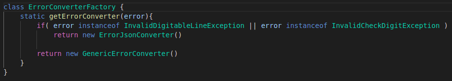

# Deploy

Pode ser feito de duas maneiras:

1 - Na linha de comando, estando na raiz do projeto executar 

    $> npm install
    $> npm run serve
 O script rodará os testes e iniciara o servidor na porta 3000
 
 2 - utilizando shell script (sistemas operacionais unix-like) 
 

    $> chmod u+x install
    $> ./install
   O script apenas executa os dois comandos acima usando bash (caso esteja no path /bin/bash)

## Justificando a Arquitetura

Escolhi estruturar o projeto usando **DDD** em dois modulos (nao foi necessário usar modulo de infraestrutura)

 - Modulo **app** (application) 
	 - Está no diretório de mesmo nome. Nele estão todos os artefatos necessarios para expor a API. Controllers, builders de conversão de data e moeda (lógica de apresentação), conversores de erro e resposta bem sucedidas (http status 200).
	 
 - Modulo **domain** (regras de negocio)
	 - Aqui constam as regras de negócio, entidades, validadores ( modulos 10 e 11 para checagem de digitos verificadores ), fabricas, exceções de negócio e use cases - equivalentes a services.

## "Emulando" container de inversão de controle
Na pasta de configuração exste um arquivo que emula um container **IoC** (config/IocContainer.js).
Neste arquivo são exportadas instancias de objetos, alnguns dos quais tem suas depencias injetadsa no construtores.

## Roteamento com closure
O arquivo responsável pelas rotas - mentira, só tem uma rota. ;) - expõe uma closure que se beneficia da simulação de inversao de controle. Ao ser executada, essa closure retorna uma função, com o controller responsável por gerar os boletos, já com todas as dependencias necessarias, que foram injetadas no "container IoC".

